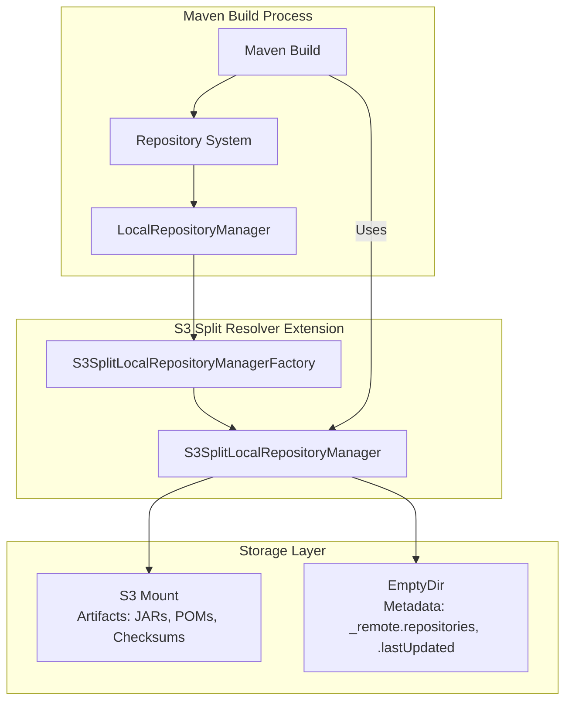
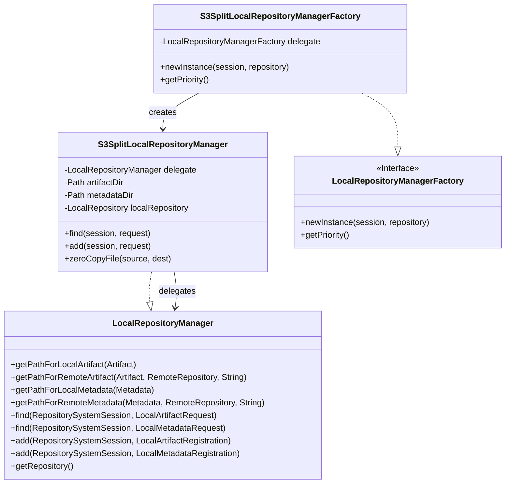
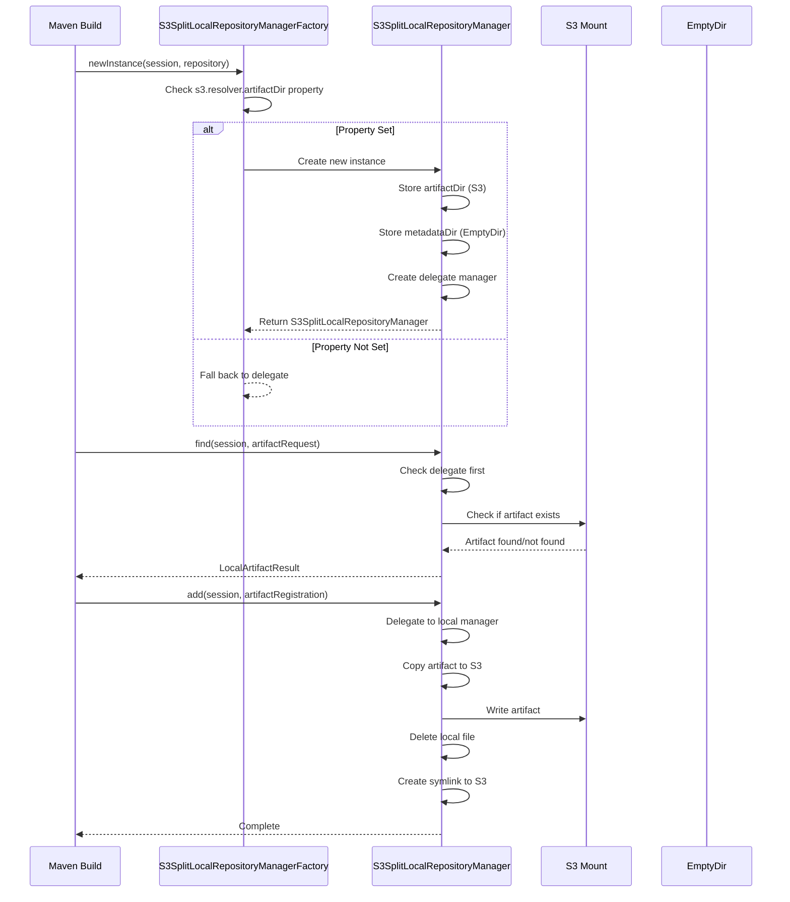
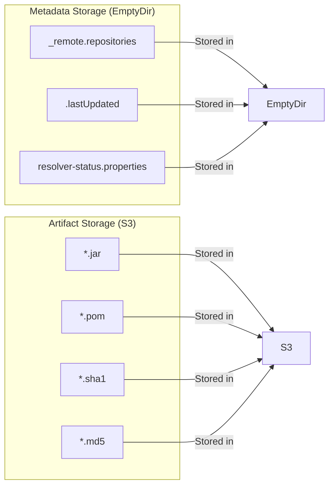
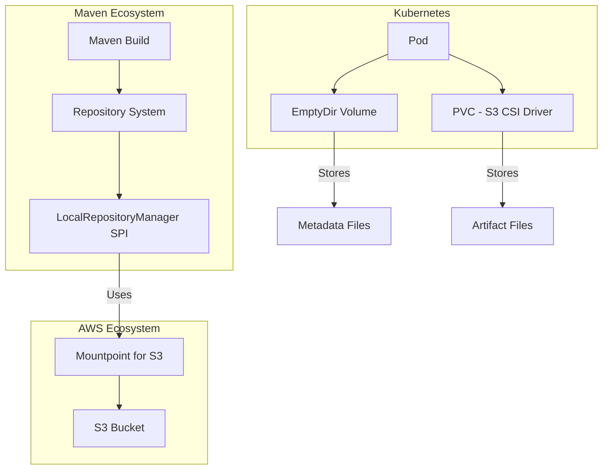
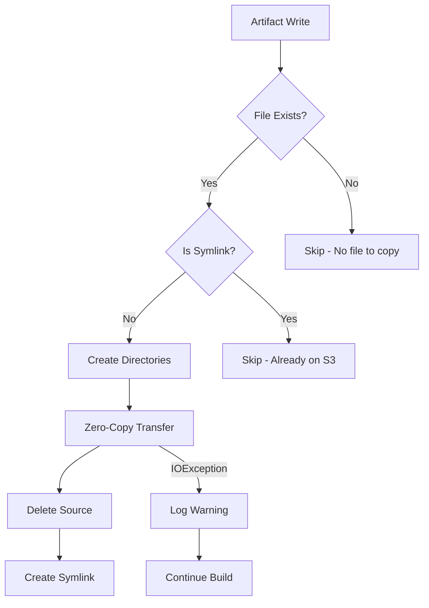

# Maven S3 Split Resolver - Architecture

## System Architecture

## Component Architecture

## Data Flow

## Storage Separation

## Key Design Decisions

### 1. Why Split Storage?

Mountpoint for S3 only supports sequential writes. Maven's metadata files use random I/O patterns that fail on S3.

### 2. Why EmptyDir for Metadata?

EmptyDir provides:
- Full POSIX I/O support
- Fast random read/write operations
- Temporary storage suitable for build artifacts

### 3. Why Zero-Copy Transfer?

`FileChannel.transferTo()` leverages OS-level optimizations (sendfile) for efficient file transfers without copying to user space.

### 4. Why Symlinks?

After transfer, symlinks allow:
- Fast artifact resolution from S3
- No duplicate storage
- Transparent access to artifacts

## Integration Points

## Error Handling

