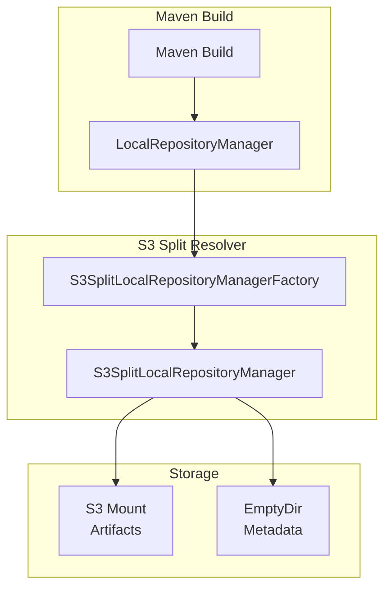

# Maven S3 Split Resolver - Codebase Information

## Overview

- **Project**: Maven S3 Split Resolver
- **Description**: Custom Maven Resolver extension that separates artifact storage from metadata storage
- **Primary Use Case**: Enable Maven builds to use S3-backed artifact caching via Mountpoint for S3

## Technology Stack

| Component | Technology |
|-----------|-----------|
| Language | Java 11+ |
| Build Tool | Maven 3.9.x |
| Dependency Injection | javax.inject (CDI) |
| Testing | JUnit 5, Mockito |
| Cloud Integration | AWS S3 (Mountpoint for S3 CSI Driver) |
| Orchestration | Kubernetes, Helm |

## Project Structure

```
ecp-maven-s3-split-resolver/
├── src/
│   ├── main/java/cloud/plasticity/maven/resolver/
│   │   ├── S3SplitLocalRepositoryManager.java          # Core resolver logic
│   │   └── S3SplitLocalRepositoryManagerFactory.java   # Factory for creating resolver
│   └── test/java/cloud/plasticity/maven/resolver/
│       ├── S3SplitLocalRepositoryManagerTest.java
│       └── S3SplitLocalRepositoryManagerFactoryTest.java
├── s3-integration/
│   └── helm-chart/                                     # Kubernetes deployment
│       ├── Chart.yaml
│       ├── values.yaml
│       └── templates/
│           ├── pv-pvc.yaml
│           └── pod.yaml
├── build-image.sh                                      # Docker image builder
└── pom.xml                                             # Maven configuration
```

## Key Components

### Core Classes

| Class | Purpose | Lines |
|-------|---------|-------|
| `S3SplitLocalRepositoryManager` | Implements Maven's `LocalRepositoryManager` to route artifacts to S3 and metadata to local | 142 |
| `S3SplitLocalRepositoryManagerFactory` | Factory that creates the resolver when `s3.resolver.artifactDir` property is set | 68 |

### Key Interfaces (from Maven Resolver)

| Interface | Purpose |
|-----------|---------|
| `LocalRepositoryManager` | Maven's interface for managing local repository operations |
| `LocalRepositoryManagerFactory` | Factory interface for creating `LocalRepositoryManager` instances |

## Architecture



## How It Works

1. **Factory Pattern**: `S3SplitLocalRepositoryManagerFactory` implements Maven's SPI to provide a custom `LocalRepositoryManager`
2. **Conditional Activation**: Only activates when `s3.resolver.artifactDir` system property is set
3. **Dual Storage**:
   - Artifacts (JARs, POMs) → Written to S3 via Mountpoint
   - Metadata (tracking files) → Written to local EmptyDir
4. **Zero-Copy Transfer**: Uses `FileChannel.transferTo()` for efficient file transfer to S3
5. **Symlink Replacement**: After transfer, replaces local file with symlink to S3 artifact

## Configuration

### System Properties

| Property | Description | Example |
|----------|-------------|---------|
| `s3.resolver.artifactDir` | Path to S3 mount for artifacts | `/home/maven/.m2/repository` |
| `maven.repo.local` | Path to metadata storage (EmptyDir) | `/home/maven/.m2-metadata/repository-metadata` |

### Maven Extension

```xml
<extensions>
  <extension>
    <groupId>cloud.plasticity</groupId>
    <artifactId>maven-s3-split-resolver</artifactId>
    <version>1.0.0</version>
  </extension>
</extensions>
```

## Dependencies

| Group | Artifact | Version | Scope |
|-------|----------|---------|-------|
| org.apache.maven.resolver | maven-resolver-api | 2.0.16 | provided |
| org.apache.maven.resolver | maven-resolver-spi | 2.0.16 | provided |
| org.apache.maven.resolver | maven-resolver-impl | 2.0.16 | provided |
| javax.inject | javax.inject | 1 | provided |
| org.junit.jupiter | junit-jupiter | 5.11.4 | test |
| org.mockito | mockito-core | 5.15.2 | test |

## Build & Deployment

### Build JAR
```bash
mvn clean package
```

### Build Docker Image
```bash
./build-image.sh [--region REGION]
```

### Deploy to Kubernetes
```bash
helm install maven-s3 ./s3-integration/helm-chart -n elastic-cicd --create-namespace
```

## Testing

| Test Class | Coverage |
|------------|----------|
| `S3SplitLocalRepositoryManagerTest` | Path separation, artifact transfer, zero-copy, symlink creation |
| `S3SplitLocalRepositoryManagerFactoryTest` | Factory activation, fallback behavior, directory creation |

## Performance Characteristics

- **Zero-Copy Transfer**: Uses `FileChannel.transferTo()` for efficient file I/O
- **S3 Caching**: Mountpoint for S3 provides local caching of frequently accessed artifacts
- **Metadata Performance**: EmptyDir storage provides fast I/O for metadata files

## License

- **AGPL-3.0** for open-source use
- **Commercial License** available for proprietary use

## Contact

- **Email**: ecosystem@plasticity.cloud
