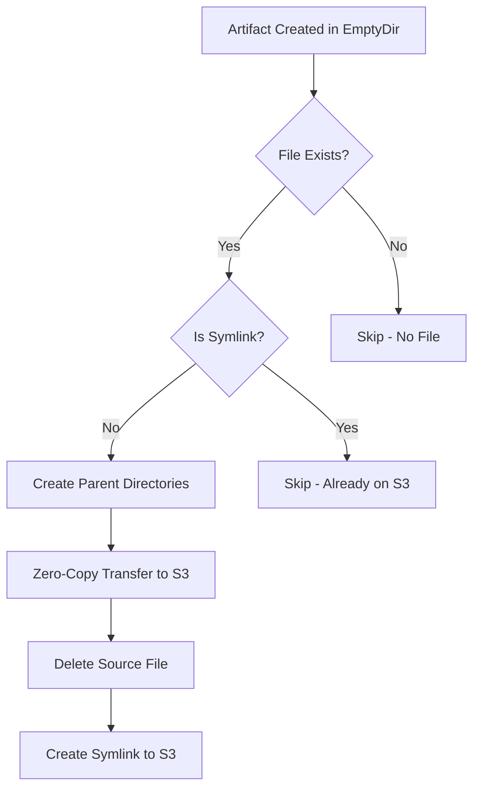
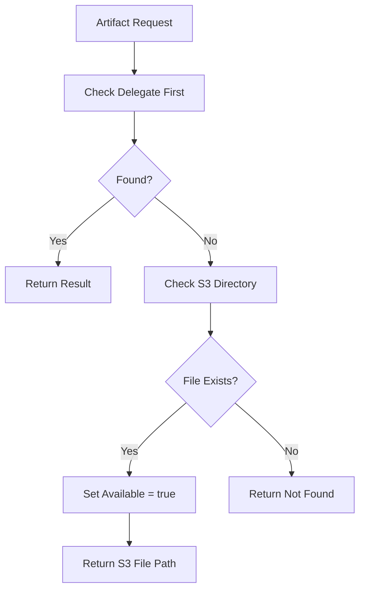
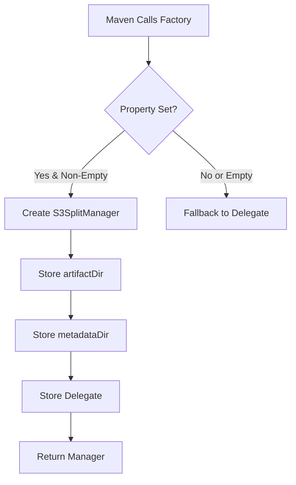
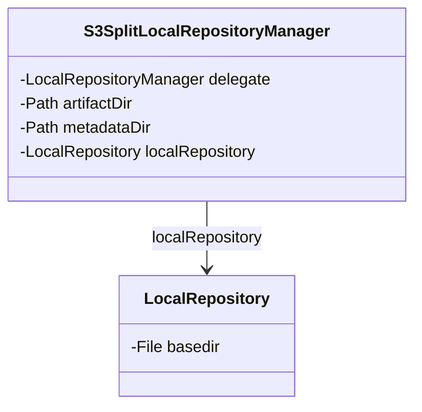
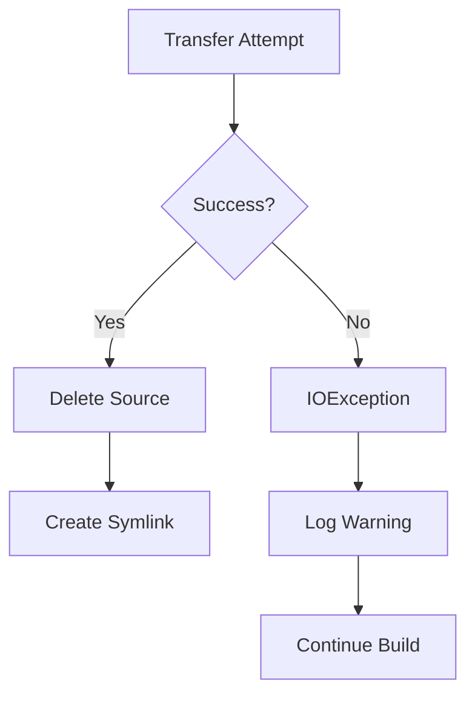
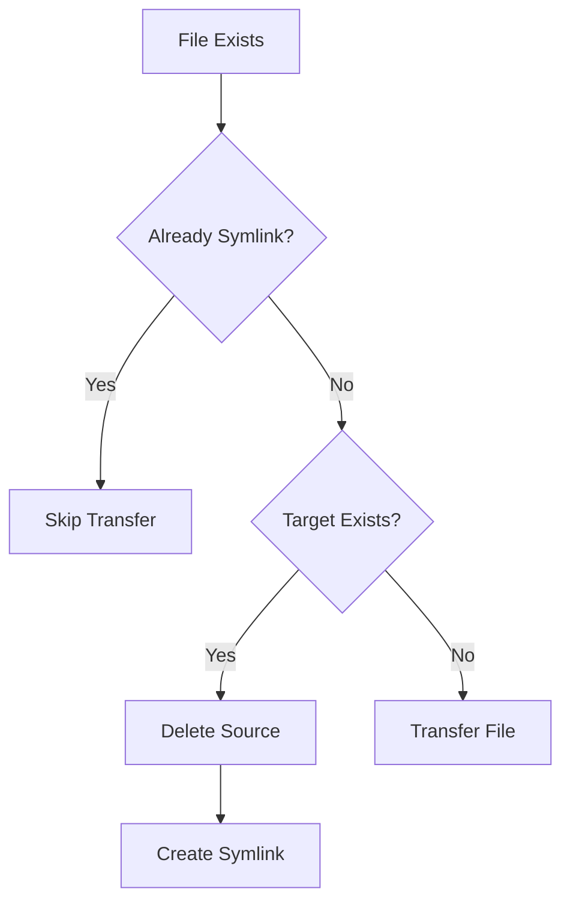

# Maven S3 Split Resolver - Data Models

## Core Data Models

### Artifact Path Structure

**S3 Storage** (`artifactDir`):
```
{groupId}/{artifactId}/{version}/{artifactId}-{version}.{extension}
```

**Example**:
```
org/apache/commons/commons-lang3/3.12.0/commons-lang3-3.12.0.jar
org/apache/commons/commons-lang3/3.12.0/commons-lang3-3.12.0.pom
org/apache/commons/commons-lang3/3.12.0/commons-lang3-3.12.0.jar.sha1
```

**EmptyDir Storage** (`metadataDir`):
```
{groupId}/{artifactId}/{version}/_remote.repositories
{groupId}/{artifactId}/{version}/.lastUpdated
{groupId}/{artifactId}/{version}/resolver-status.properties
```

### Artifact File Types

| Type | Extension | Description |
|------|-----------|-------------|
| Main artifact | `.jar` | The primary artifact (JAR, WAR, etc.) |
| POM file | `.pom` | Maven POM file |
| SHA1 checksum | `.sha1` | SHA-1 checksum |
| MD5 checksum | `.md5` | MD5 checksum |

### Metadata File Types

| File | Purpose |
|------|---------|
| `_remote.repositories` | Tracks which remote repository each artifact came from |
| `.lastUpdated` | Timestamp of last update for snapshot versions |
| `resolver-status.properties` | Resolver state and status information |

## Data Flow Models

### Artifact Write Flow



### Artifact Read Flow



### Factory Activation Flow



## State Models

### S3SplitLocalRepositoryManager State



### Repository Paths

| Path Type | Variable | Example |
|-----------|----------|---------|
| S3 Artifact Directory | `artifactDir` | `/home/maven/.m2/repository` |
| EmptyDir Metadata Directory | `metadataDir` | `/home/maven/.m2-metadata/repository-metadata` |
| Local Repository Base | `localRepository.basedir` | Same as `metadataDir` |

## File Transfer Model

### Zero-Copy Transfer

**Implementation**:
```java
try (FileChannel srcChannel = FileChannel.open(source, StandardOpenOption.READ);
     FileChannel dstChannel = FileChannel.open(dest, StandardOpenOption.WRITE, 
                                               StandardOpenOption.CREATE, 
                                               StandardOpenOption.TRUNCATE_EXISTING)) {
    long size = srcChannel.size();
    long transferred = 0;
    while (transferred < size) {
        transferred += srcChannel.transferTo(transferred, size - transferred, dstChannel);
    }
}
```

**Characteristics**:
- Uses `FileChannel.transferTo()` for OS-level optimization
- Leverages `sendfile()` system call when available
- No user-space buffering required
- Efficient for large files

### Symlink Creation

**Pattern**:
```
Source: /home/maven/.m2-metadata/repository/org/example/artifact/1.0/artifact-1.0.jar
Target: /home/maven/.m2/repository/org/example/artifact/1.0/artifact-1.0.jar
```

**Purpose**:
- Fast artifact resolution from S3
- No duplicate storage
- Transparent access

## Error State Models

### Transfer Failure Handling



### Duplicate File Handling



## Configuration Models

### System Property Configuration

| Property | Type | Required | Default | Description |
|----------|------|----------|---------|-------------|
| `s3.resolver.artifactDir` | String | No | None | S3 mount path for artifacts |
| `maven.repo.local` | String | No | ~/.m2/repository | EmptyDir path for metadata |

### Priority Model

| Component | Priority | Description |
|-----------|----------|-------------|
| Default Manager | 0.0 | Maven's default local repository manager |
| S3 Split Manager | 100.0 | Custom S3-aware manager (higher priority) |
