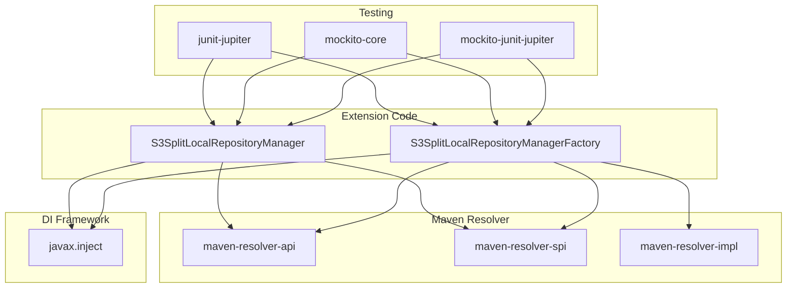

# Maven S3 Split Resolver - Dependencies

## Maven Dependencies

### Provided Dependencies (Runtime)

| Group | Artifact | Version | Purpose |
|-------|----------|---------|---------|
| org.apache.maven.resolver | maven-resolver-api | 2.0.16 | Maven Resolver API interfaces |
| org.apache.maven.resolver | maven-resolver-spi | 2.0.16 | Maven Resolver SPI interfaces |
| org.apache.maven.resolver | maven-resolver-impl | 2.0.16 | Maven Resolver implementation |
| javax.inject | javax.inject | 1 | Dependency injection annotations |

### Test Dependencies

| Group | Artifact | Version | Purpose |
|-------|----------|---------|---------|
| org.junit.jupiter | junit-jupiter | 5.11.4 | JUnit 5 testing framework |
| org.mockito | mockito-core | 5.15.2 | Mocking framework |
| org.mockito | mockito-junit-jupiter | 5.15.2 | JUnit 5 integration for Mockito |

## External Services

### AWS S3

**Integration**: Mountpoint for S3 CSI Driver

**Purpose**: Artifact storage (JARs, POMs, checksums)

**Configuration**:
- Driver: `s3.csi.aws.com`
- Mount Options: `allow-delete`, `allow-overwrite`, `allow-other`, `metadata-ttl 300`, `read-part-size 5242880`, `max-threads 16`
- Cache: `emptyDir` with configurable size

### Kubernetes

**Integration**: Pod deployment

**Purpose**: Build environment

**Components**:
- EmptyDir volumes for metadata
- PVC for S3 mount
- Security context for non-root user

## Build Dependencies

### Maven Plugins

| Group | Artifact | Version | Purpose |
|-------|----------|---------|---------|
| org.apache.maven.plugins | maven-compiler-plugin | 3.15.0 | Java compilation |
| org.apache.maven.plugins | maven-surefire-plugin | 3.5.2 | Unit testing |

### Build Tools

| Tool | Purpose |
|------|---------|
| Maven 3.9.x | Build tool and dependency management |
| Docker | Container image building |
| AWS CLI | ECR authentication and image push |
| Helm | Kubernetes deployment |

## Runtime Dependencies

### Base Image

| Component | Version | Purpose |
|-----------|---------|---------|
| Amazon Corretto | 21 | Java runtime |
| Alpine Linux | 2023 | Base OS |
| Git | Version control |

### S3 CSI Driver

| Component | Version | Purpose |
|-----------|---------|---------|
| Mountpoint for S3 | Latest | S3 file system interface |

## Dependency Graph



## Transitive Dependencies

### Maven Resolver

The extension uses Maven Resolver 2.0.16 which includes:
- `maven-resolver-api`: Core interfaces
- `maven-resolver-spi`: Service provider interfaces
- `maven-resolver-impl`: Implementation classes

### Testing Framework

- **JUnit Jupiter**: JUnit 5 testing framework
- **Mockito Core**: Mocking capabilities
- **Mockito JUnit Jupiter**: Integration with JUnit 5

## Version Compatibility

| Component | Version | Notes |
|-----------|---------|-------|
| Java | 11+ | Minimum Java 11 required |
| Maven | 3.9.x | Tested with 3.9.9 |
| Maven Resolver | 2.0.16 | API/SPi version |
| Kubernetes | 1.20+ | Tested with EKS |
| Mountpoint for S3 | Latest | CSI driver |

## Dependency Management

### Maven POM Configuration

```xml
<properties>
    <maven.version>3.9.9</maven.version>
    <resolver.version>2.0.16</resolver.version>
</properties>

<dependencies>
    <!-- Provided dependencies -->
    <dependency>
        <groupId>org.apache.maven.resolver</groupId>
        <artifactId>maven-resolver-api</artifactId>
        <version>${resolver.version}</version>
        <scope>provided</scope>
    </dependency>
    
    <!-- Test dependencies -->
    <dependency>
        <groupId>org.junit.jupiter</groupId>
        <artifactId>junit-jupiter</artifactId>
        <version>5.11.4</version>
        <scope>test</scope>
    </dependency>
</dependencies>
```

## Security Dependencies

### AWS IAM Permissions

| Permission | Resource | Purpose |
|------------|----------|---------|
| `s3:GetObject` | S3 bucket | Read artifacts from S3 |
| `s3:PutObject` | S3 bucket | Write artifacts to S3 |
| `ecr:GetAuthorizationToken` | ECR | Docker authentication |
| `sts:GetCallerIdentity` | STS | Account ID lookup |

### Kubernetes Security Context

| Setting | Value | Purpose |
|---------|-------|---------|
| runAsUser | 1000 | Non-root user |
| runAsGroup | 1000 | Non-root group |
| fsGroup | 1000 | File group |
| runAsNonRoot | true | Enforce non-root |
