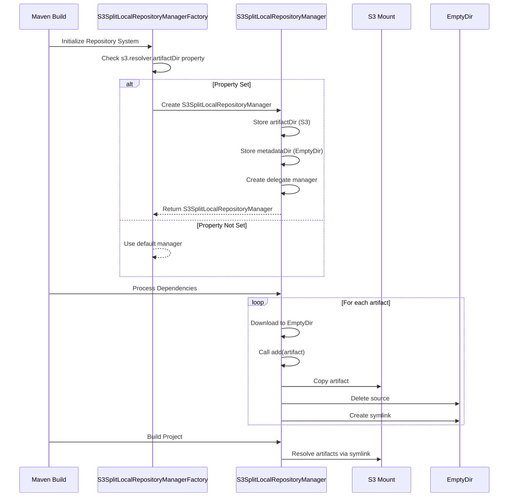
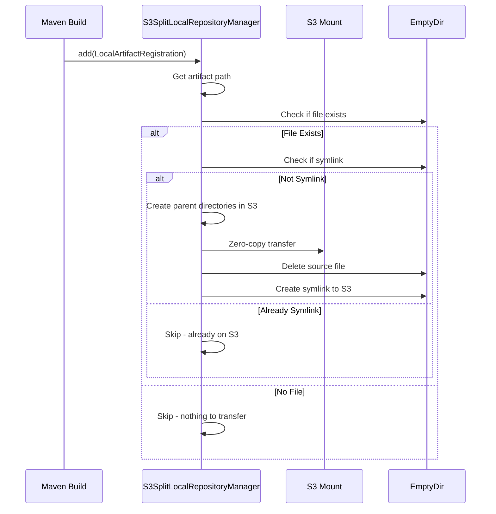
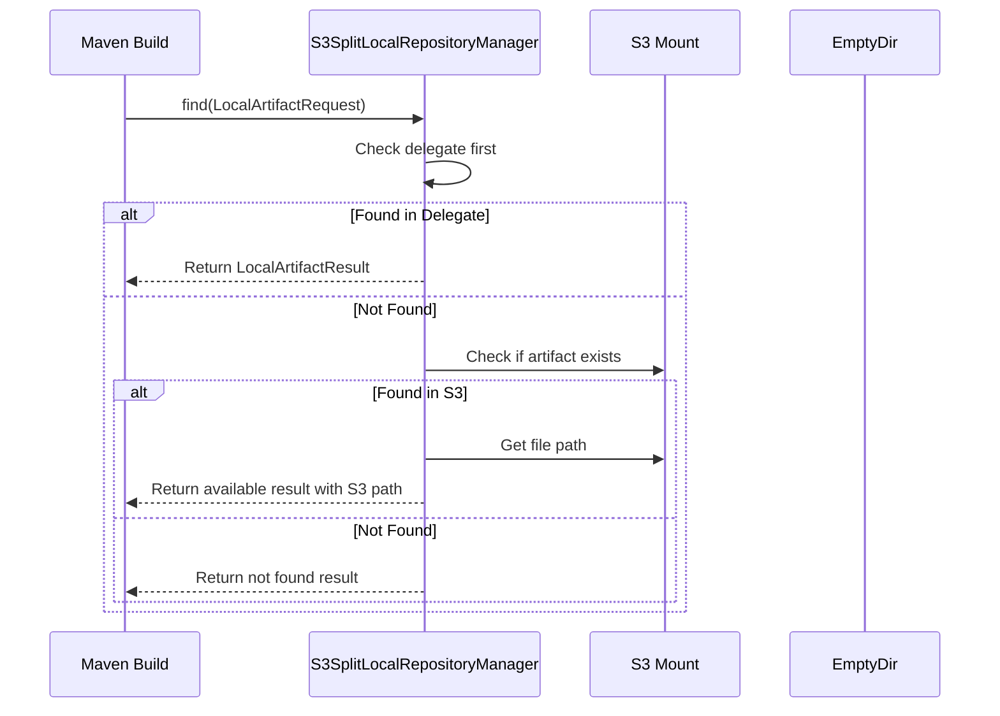
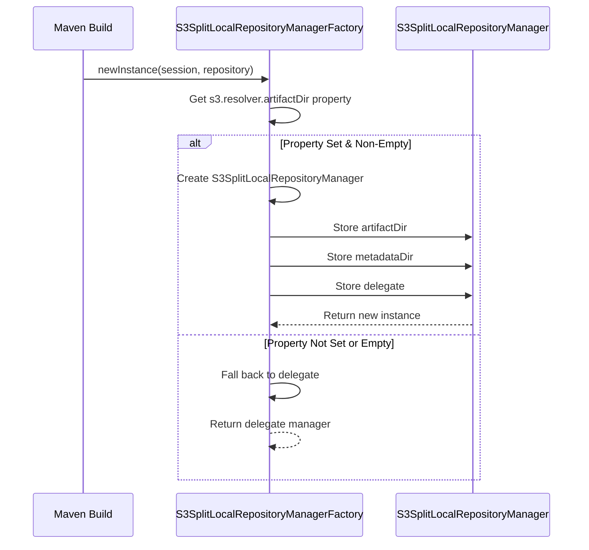
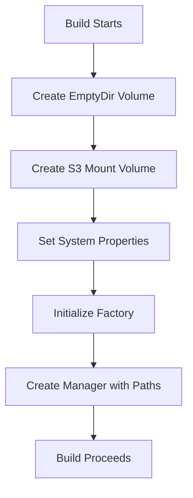
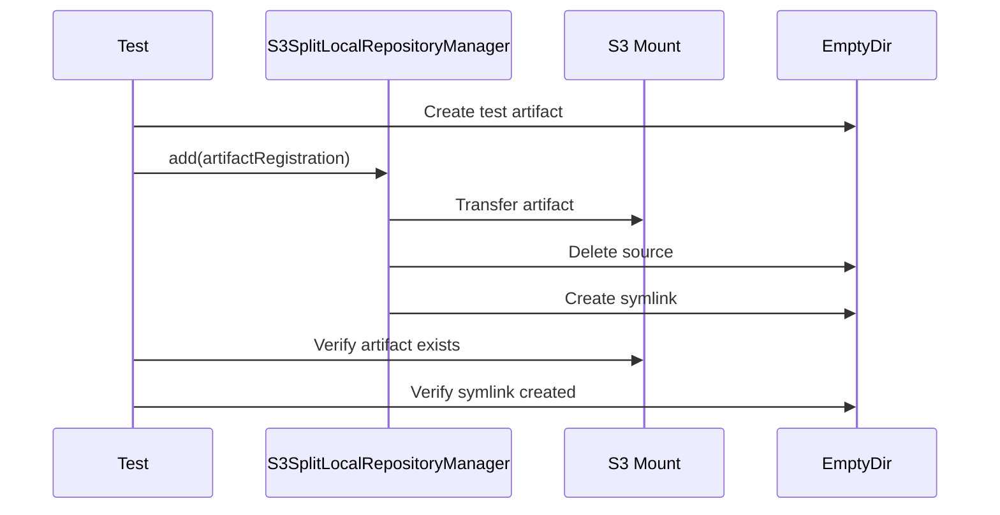
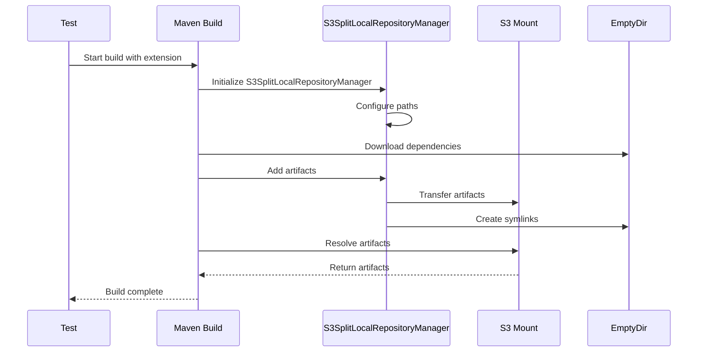
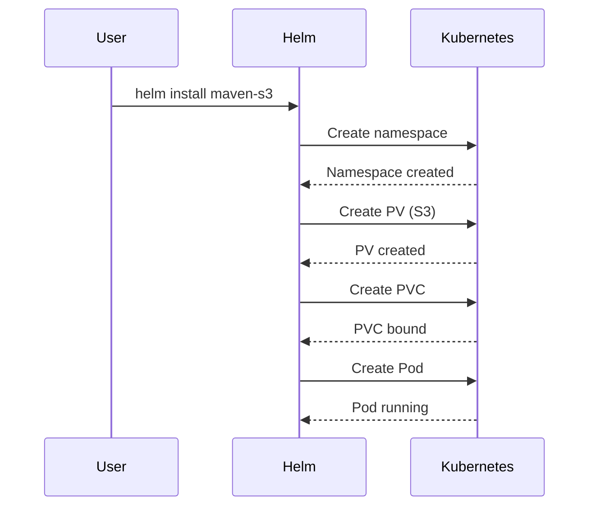
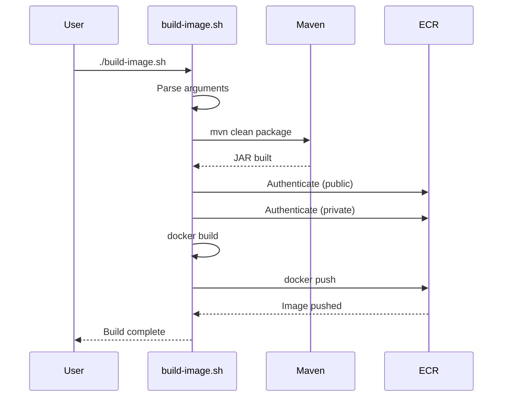
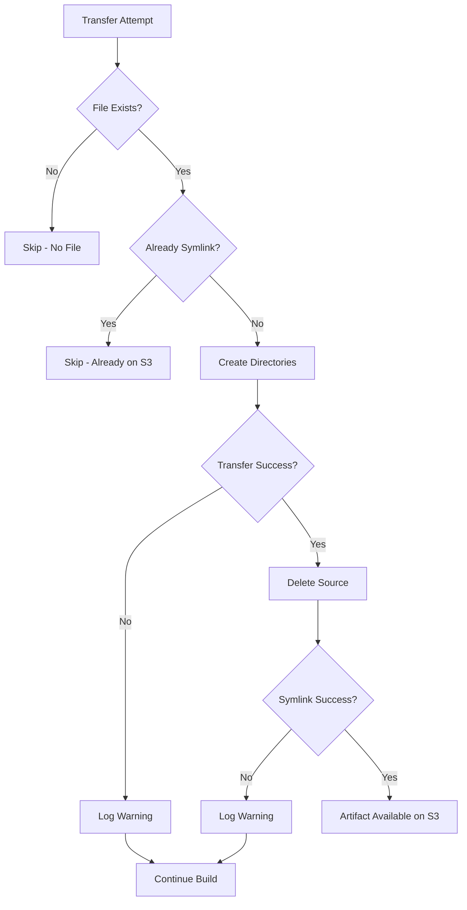

# Maven S3 Split Resolver - Workflows

## Build Workflow

## Artifact Transfer Workflow

## Artifact Resolution Workflow

## Factory Activation Workflow

## Directory Setup Workflow

## Test Workflow

### Unit Test: Artifact Transfer

### Integration Test: End-to-End

## Deployment Workflow

### Helm Chart Deployment

### Docker Build Workflow

## Error Recovery Workflow

