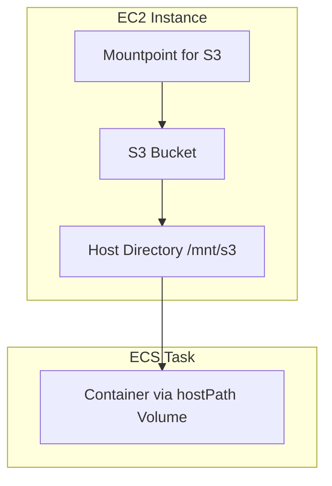

# Mountpoint for S3 Integration Documentation

## Supported Environments

| Environment | Mountpoint Support | Notes |
|-------------|-------------------|-------|
| **EC2 (Amazon Linux 2023)** | ✅ Yes | Included in AL2023, install via `dnf install mountpoint-s3` |
| **ECS on EC2** | ✅ Yes | Use hostPath volumes to mount S3 from host |
| **EKS** | ✅ Yes | CSI driver v2 available as EKS add-on |
| **CodeBuild** | ❌ No | Not supported - no FUSE support |

## ECS on EC2 Integration

### Architecture



### Setup Steps

1. **Install Mountpoint on EC2 host**
2. **Mount S3 bucket to host directory**
3. **Configure ECS task with hostPath volume**

### ECS Task Definition Example

```json
{
  "containerDefinitions": [{
    "name": "maven-builder",
    "mountPoints": [{
      "sourceVolume": "s3-cache",
      "containerPath": "/home/maven/.m2/repository"
    }]
  }],
  "volumes": [{
    "name": "s3-cache",
    "host": {
      "sourcePath": "/mnt/s3/cache"
    }
  }]
}
```

## EC2 Workstation Integration

### Installation (Amazon Linux 2023)

```bash
# Install Mountpoint (already included in AL2023)
sudo dnf install mountpoint-s3

# Mount S3 bucket
sudo mount-s3 <bucket-name> /mnt/s3 --allow-delete --allow-overwrite
```

### CPU Architecture

No manual detection needed - AL2023 package manager automatically selects the correct architecture.

## Proposed Directory Structure

```
s3-integration/
├── helm-chart/                    # EKS (existing)
├── ecs-ec2/                       # ECS on EC2 (new)
│   ├── cloudformation/
│   │   ├── ecs-cluster.yaml       # ECS cluster with S3 mount
│   │   └── task-definition.yaml   # Task definition with hostPath
│   └── scripts/
│       ├── install-mountpoint.sh  # Install Mountpoint on EC2
│       └── setup-s3-mount.sh      # Mount S3 bucket
├── ec2-workstation/               # EC2 workstation (new)
│   ├── scripts/
│   │   └── install-mountpoint.sh  # Install Mountpoint
│   └── README.md                  # Setup instructions
└── codebuild/                     # CodeBuild guidance (new)
    └── README.md                  # Alternative approach using S3 caching
```
