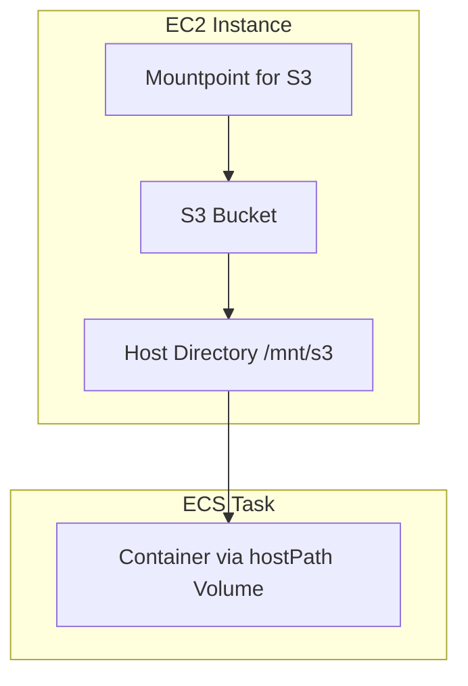

# ECS on EC2 Integration Guide

## Overview

This integration allows ECS tasks running on EC2 to use Mountpoint for S3 for high-throughput S3 access.

## Architecture



## Setup

### 1. Install Mountpoint on EC2 Host

```bash
./install-mountpoint.sh
```

### 2. Mount S3 Bucket

```bash
./setup-s3-mount.sh <bucket-name> /mnt/s3
```

### 3. Configure ECS Task

Use the provided CloudFormation templates or manually configure your task definition with a hostPath volume:

```json
{
  "containerDefinitions": [{
    "name": "maven-builder",
    "mountPoints": [{
      "sourceVolume": "s3-cache",
      "containerPath": "/home/maven/.m2/repository"
    }]
  }],
  "volumes": [{
    "name": "s3-cache",
    "host": {
      "sourcePath": "/mnt/s3/cache"
    }
  }]
}
```

## Benefits

- High-throughput S3 access without copying
- No FUSE requirements in containers
- Simple integration with existing ECS workflows
